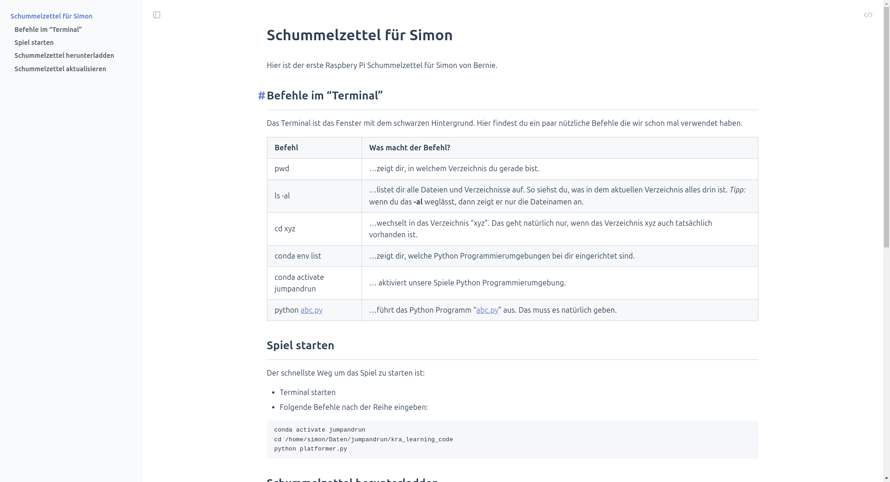

# Schummelzettel für Simon

Hier ist der erste Raspbery Pi Schummelzettel für Simon von Bernie.

## Befehle im "Terminal" 
Das Terminal ist das Fenster mit dem schwarzen Hintergrund. Hier findest du ein paar nützliche Befehle die wir schon mal verwendet haben.

| Befehl | Was macht der Befehl? | 
| -- | -- | 
| pwd | ...zeigt dir, in welchem Verzeichnis du gerade bist. | 
| ls -al | ...listet dir alle Dateien und Verzeichnisse auf. So siehst du, was in dem aktuellen Verzeichnis alles drin ist. *Tipp:* wenn du das **-al** weglässt, dann zeigt er nur die Dateinamen an. |
| cd xyz | ...wechselt in das Verzeichnis "xyz". Das geht natürlich nur, wenn das Verzeichnis xyz auch tatsächlich vorhanden ist. |
| conda env list | ...zeigt dir, welche Python Programmierumgebungen bei dir eingerichtet sind. |
| conda activate jumpandrun | ... aktiviert unsere Spiele Python Programmierumgebung. |
| python abc.py | ...führt das Python Programm "abc.py" aus. Das muss es natürlich geben. |

## Spiel starten

Der schnellste Weg um das Spiel zu starten ist:

* Terminal starten
* Folgende Befehle nach der Reihe eingeben:

```
conda activate jumpandrun
cd /home/simon/Daten/jumpandrun/kra_learning_code
python platformer.py
```

## Schummelzettel herunterladden

Beim ersten Mal ladest du den Schummelzettel folgendermaßen herunter:

```bash
cabbage@MSI-ubuntu:~/Daten$ git clone https://github.com/becabbage/simon_schummelzettel
Cloning into 'simon_schummelzettel'...
remote: Enumerating objects: 6, done.
remote: Counting objects: 100% (6/6), done.
remote: Compressing objects: 100% (3/3), done.
remote: Total 6 (delta 0), reused 0 (delta 0), pack-reused 0 (from 0)
Receiving objects: 100% (6/6), done.
cabbage@MSI-ubuntu:~/Daten$
```
## Schummelzettel aktualisieren

So kannst du nachsehen, ob ich auf dem Schummler etwas hinzugefügt oder ausgebessert oder ergänzt habe.

```
cabbage@MSI-ubuntu:~/Daten/simon_schummelzettel$ git fetch 
cabbage@MSI-ubuntu:~/Daten/simon_schummelzettel$ git merge
Updating 46a08f7..eafead7
Fast-forward
 README.md | 11 ++++++++---
 1 file changed, 8 insertions(+), 3 deletions(-)
cabbage@MSI-ubuntu:~/Daten/simon_schummelzettel$
```

order 

```bash
cabbage@MSI-ubuntu:~/Daten/simon_schummelzettel$ git pull
remote: Enumerating objects: 5, done.
remote: Counting objects: 100% (5/5), done.
remote: Compressing objects: 100% (2/2), done.
remote: Total 3 (delta 1), reused 0 (delta 0), pack-reused 0 (from 0)
Unpacking objects: 100% (3/3), 968 bytes | 968.00 KiB/s, done.
From github.com:becabbage/simon_schummelzettel
   eafead7..5b01239  main       -> origin/main
Updating eafead7..5b01239
Fast-forward
 README.md | 10 +++++++++-
 1 file changed, 9 insertions(+), 1 deletion(-)
cabbage@MSI-ubuntu:~/Daten/simon_schummelzettel$ 
```

## Schummelzettel anzeigen

So kannst du den Schummelzettel anzeigen, wenn du ihn auf deinen Computer heruntergeladen hast.
(Achtung: Aktualisiere den Schummelzettel, wenn du die neueste Version haben möchtest)

1) Öffne das Terminal
2) Gib folgenden Befehl ein


```bash
cabbage@MSI-ubuntu:~$ cd Daten/simon_schummelzettel/
cabbage@MSI-ubuntu:~/Daten/simon_schummelzettel$ chromium README.md
Opening in existing browser session.
cabbage@MSI-ubuntu:~/Daten/simon_schummelzettel$
```
3) Dann öffnet sich der Browser mit dem Schummelzettel

